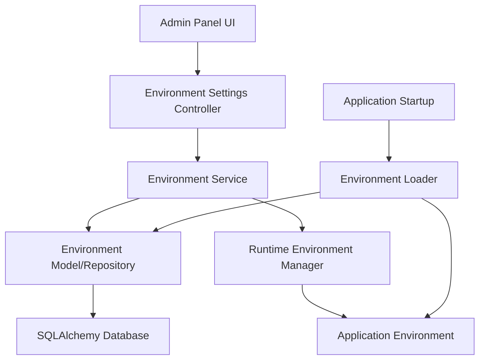

# Design Document

## Overview

The admin environment settings feature will add a new administrative interface to the existing Flask real estate CRM application, allowing administrators to manage environment variables through a web interface. The design leverages the existing Flask-SQLAlchemy architecture and follows the established patterns in the codebase.

The solution will store environment variables in the database and provide a runtime mechanism to update the application's environment without requiring restarts. This approach ensures persistence across deployments while maintaining the flexibility of environment-based configuration.

## Architecture

### High-Level Architecture



### Component Interaction Flow

1. **Initialization**: On application startup, the Environment Loader reads stored environment variables from the database and applies them to the runtime environment
2. **Admin Interface**: Administrators access environment settings through a dedicated admin panel page
3. **CRUD Operations**: The Environment Settings Controller handles create, read, update, and delete operations for environment variables
4. **Runtime Updates**: The Runtime Environment Manager immediately applies changes to the application's environment
5. **Persistence**: All changes are stored in the database for persistence across restarts

## Components and Interfaces

### 1. Database Model

**EnvironmentVariable Model**
```python
class EnvironmentVariable(db.Model):
    id: int (Primary Key)
    key: str (Unique, Not Null)
    value: str (Encrypted for sensitive values)
    description: str (Optional)
    is_sensitive: bool (Default: False)
    is_required: bool (Default: False)
    created_at: datetime
    updated_at: datetime
    created_by: str (Admin identifier)
```

### 2. Service Layer

**EnvironmentService**
- `get_all_variables()` - Retrieve all environment variables with masked sensitive values
- `get_variable(key: str)` - Get a specific environment variable
- `create_variable(key: str, value: str, **metadata)` - Create new environment variable
- `update_variable(key: str, value: str)` - Update existing environment variable
- `delete_variable(key: str)` - Remove environment variable
- `apply_to_runtime()` - Apply all stored variables to runtime environment
- `validate_variable(key: str, value: str)` - Validate variable format and constraints

**RuntimeEnvironmentManager**
- `update_environment(key: str, value: str)` - Update runtime environment
- `remove_from_environment(key: str)` - Remove from runtime environment
- `get_current_value(key: str)` - Get current runtime value
- `backup_current_state()` - Create backup before changes
- `rollback_changes()` - Rollback to previous state if validation fails

### 3. Controller Layer

**EnvironmentSettingsController (Blueprint)**
- `GET /admin/environment` - Display environment variables page
- `POST /admin/environment` - Create new environment variable
- `PUT /admin/environment/<key>` - Update existing environment variable
- `DELETE /admin/environment/<key>` - Delete environment variable
- `GET /admin/environment/history` - View change history

### 4. Security and Validation

**SecurityManager**
- `mask_sensitive_value(value: str)` - Mask sensitive values for display
- `encrypt_value(value: str)` - Encrypt sensitive values for storage
- `decrypt_value(encrypted_value: str)` - Decrypt values for runtime use
- `is_sensitive_key(key: str)` - Determine if key contains sensitive data

**ValidationManager**
- `validate_key_format(key: str)` - Ensure key follows naming conventions
- `validate_required_variables()` - Check all required variables are present
- `validate_application_health()` - Test application functionality after changes

## Data Models

### Environment Variable Schema

```sql
CREATE TABLE environment_variables (
    id INTEGER PRIMARY KEY AUTOINCREMENT,
    key VARCHAR(255) UNIQUE NOT NULL,
    value TEXT NOT NULL,
    description TEXT,
    is_sensitive BOOLEAN DEFAULT FALSE,
    is_required BOOLEAN DEFAULT FALSE,
    created_at DATETIME DEFAULT CURRENT_TIMESTAMP,
    updated_at DATETIME DEFAULT CURRENT_TIMESTAMP,
    created_by VARCHAR(255)
);
```

### Environment Change Log Schema

```sql
CREATE TABLE environment_change_log (
    id INTEGER PRIMARY KEY AUTOINCREMENT,
    variable_key VARCHAR(255) NOT NULL,
    action VARCHAR(50) NOT NULL, -- 'CREATE', 'UPDATE', 'DELETE'
    old_value TEXT,
    new_value TEXT,
    changed_by VARCHAR(255),
    changed_at DATETIME DEFAULT CURRENT_TIMESTAMP,
    FOREIGN KEY (variable_key) REFERENCES environment_variables(key)
);
```

## Error Handling

### Error Categories

1. **Validation Errors**
   - Invalid key format (non-alphanumeric, spaces)
   - Duplicate key creation
   - Missing required variables
   - Invalid value format for specific variable types

2. **Runtime Errors**
   - Application health check failures after environment changes
   - Database connection issues
   - Encryption/decryption failures

3. **Security Errors**
   - Unauthorized access attempts
   - Attempts to modify critical system variables
   - Invalid authentication for sensitive operations

### Error Handling Strategy

- **Graceful Degradation**: If environment loading fails, use default values and log warnings
- **Rollback Mechanism**: Automatically rollback changes that break application functionality
- **User Feedback**: Provide clear error messages in the admin interface
- **Logging**: Comprehensive logging of all environment changes and errors

## Testing Strategy

### Unit Tests

1. **Model Tests**
   - Environment variable CRUD operations
   - Data validation and constraints
   - Encryption/decryption functionality

2. **Service Tests**
   - Environment variable management operations
   - Runtime environment updates
   - Validation logic

3. **Controller Tests**
   - HTTP endpoint functionality
   - Request/response handling
   - Authentication and authorization

### Integration Tests

1. **Database Integration**
   - SQLAlchemy model interactions
   - Migration scripts
   - Data persistence across restarts

2. **Runtime Integration**
   - Environment variable application to runtime
   - Application functionality with modified environment
   - Rollback mechanisms

### End-to-End Tests

1. **Admin Interface**
   - Complete CRUD workflows through web interface
   - Form validation and error handling
   - Security features (masking, encryption)

2. **Application Impact**
   - Verify environment changes affect application behavior
   - Test application restart with stored environment variables
   - Validate required variable enforcement

### Security Tests

1. **Access Control**
   - Unauthorized access prevention
   - Admin authentication requirements
   - Sensitive data protection

2. **Data Protection**
   - Encryption of sensitive values
   - Secure transmission of environment data
   - Audit trail integrity

## Implementation Considerations

### Performance

- **Lazy Loading**: Load environment variables only when needed
- **Caching**: Cache frequently accessed variables in memory
- **Batch Operations**: Support bulk updates for efficiency

### Security

- **Encryption**: Use Flask's secret key for encrypting sensitive environment values
- **Access Control**: Require admin authentication for all environment operations
- **Audit Trail**: Log all changes with timestamps and user identification

### Scalability

- **Database Indexing**: Index environment variable keys for fast lookups
- **Memory Management**: Efficient handling of environment variable storage
- **Concurrent Access**: Handle multiple admin users modifying environment simultaneously

### Backward Compatibility

- **Existing Environment Variables**: Preserve existing environment variables during migration
- **Fallback Mechanism**: Fall back to system environment variables if database is unavailable
- **Migration Strategy**: Provide migration script to import existing environment variables